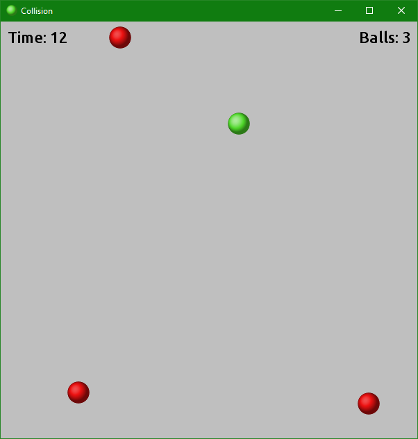
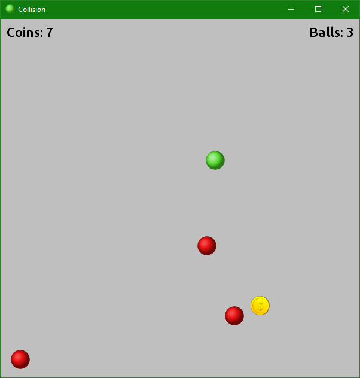

Collision 2
===========

[][gpl3]

In this game you control a green ball. Using your mouse or keyboard, you have to
avoid hitting the ever increasing number of red balls that are moving around in
the game window. The moment you touch one of them, the game is over.

The game has three difficulty levels and two modes:

*   **Time**: you have to dodge the red balls for as long as possible. Every few
    seconds a new red ball appears. The longer you last, the higher the score
    will be.
*   **Coins**: you have to catch as many coins as you can. Every few coins a new
    red ball appears. The more coins you gather, the higher the score will be.

During the game different bonuses can also appear. These can provide either a
positive or a negative effect.

This game was developed in Java and LibGDX, and was inspired by
[Kollision][kollision], a KDE game.

## Screenshots

[install]: INSTALL.md
[gpl3]: http://www.gnu.org/licenses/gpl-3.0.html "GNU General Public License v3"
[kollision]: https://www.kde.org/applications/games/kollision/ "KDE - Kollision"